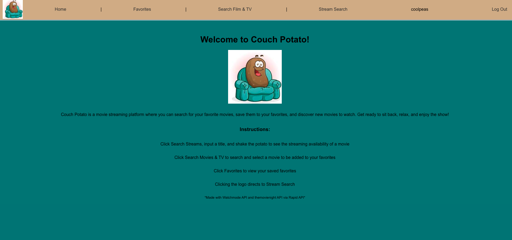
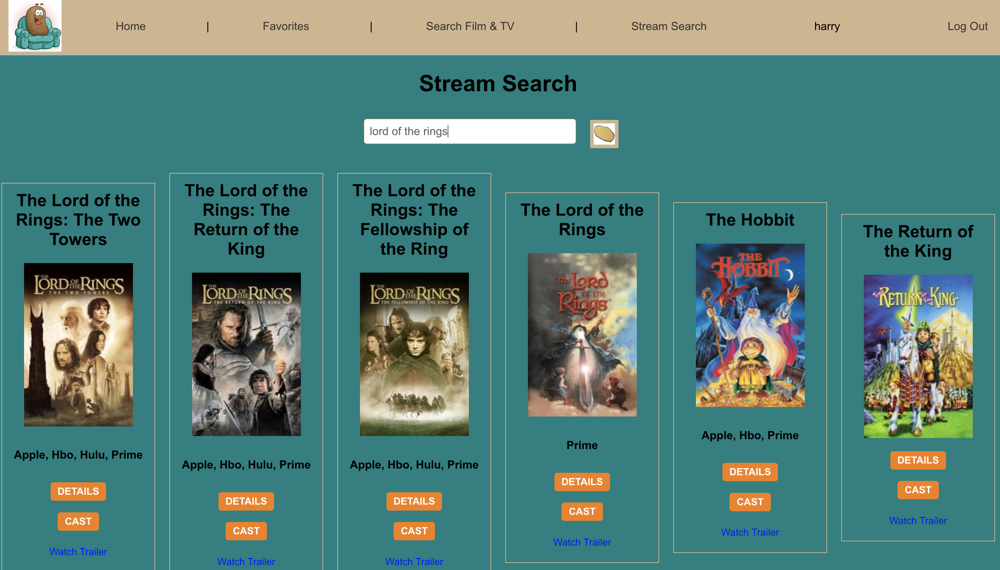
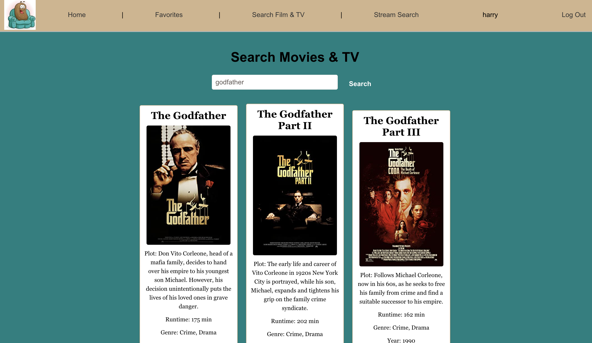
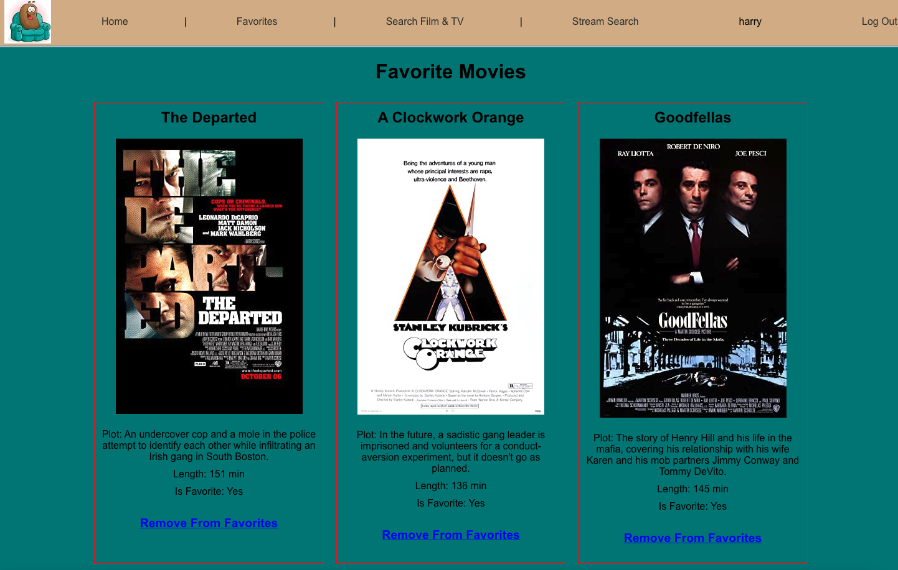

# Couch Potato

*** has been updated for better usability. README updates to come soon

Couch Potato is a full-stack, single-page application that allows users to discover new movies, find out where they're streaming, and save their favorite movies to watch later. With Couch Potato, you can easily explore a wide range of movies and keep track of your personal watchlist.

## Screenshot(s)

- Landing Page

- Search Streams Page

- Search Movies Page

- Favorite Movies Page

## Technologies Used

- MongoDB/Mongoose
- Express
- React
- Node
- watchmode API
- themovienight API
- Render
- Javascript 
- CSS

## Getting Started

- Click here to get started: https://couch-potato.onrender.com

- Trello Board: https://trello.com/b/ltqM62c8/project-4

## Next Steps

- Here are some planned future enhancements for Couch Potato:

    - Social features to enable users to share movie recommendations and watchlists with friends.
    - Enhanced search functionality, including filters and sorting options.
    - Implementation of a personalized recommendation engine based on user preferences and viewing history.
    - TV series capabilities for stream search
    - more styling